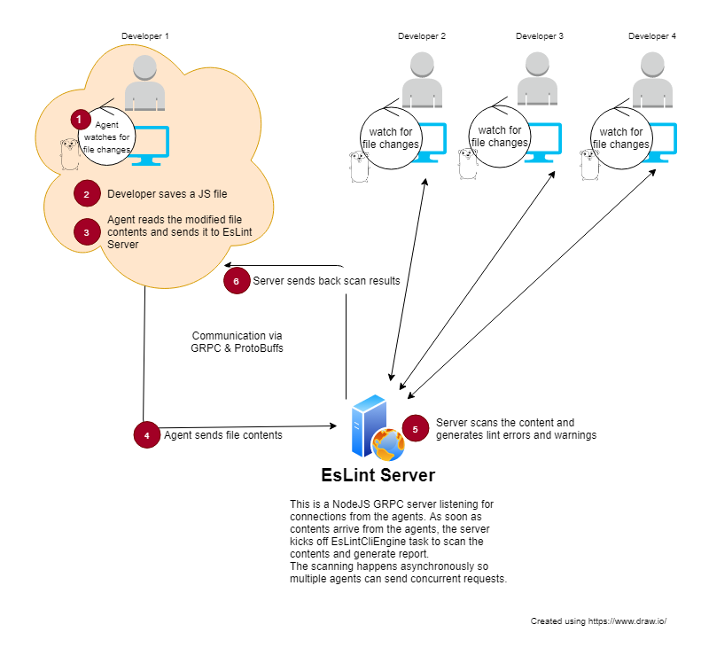

## Eslint Server written in NodeJS and EsLint Desktop Client written in Go
This application uses a NodeJS GRPC (Google Remote Procedure Call using protocol buffers for data exchange) server to host EsLint CLIEngine Utility. Go client running in Command Prompt / Terminal functions as agents to watch filesystem for any modifications to the JS files and sends the modified file to the NodeJS GRPC server using protobuffs. NodeJS GRPC server scans the content, generates the report and sends back to the Go Client (using protobuff). Go client running in terminal then displays the error/warnings accordingly.

### Usage
```bash
EsLintClient.exe --help

Usage of EsLintClient.exe:
  -file string
        File name with full path to be sent to the EsLint Server for scanning. Note that this is a one-off execution of the client for a single file. EsLintClient terminates after it displays scan result for the file

  -report
        Scans all javascript files in the workspace and generates report.csv file.
        Warning: if configured with remote EsLint server this might take long time depending on the number of files in the workspace

  -server string
        URL of the EsLint Server, defaults to 'eslintServerURL' value configured in config.json

  -src string
        Path to the source code directory, defaults to 'workspacePath' value configured in config.json

```


Here's how the Go Client with scan output looks:


### How is this intended to be used ?
The basic idea is the developers working on JavaScript code should connect to the remote EsLint Server through the "EsLint Go Client" from their machines. The Go Client will monitor the developer's workstation (a specific directory) for any modifications and will send the modified files to the EsLint Server for scanning as soon as the files are modified. There is negligible network latency (especially if the server is running on intranet, etc.) This process is blazing fast since protobuffs are designed to be fast, lightweight and super fast way to communicate between client & server.

### Design


### Why is it better than running EsLint locally ?
As always, the answer is, it depends. This system has some advantages over running the tool locally:
- Centralized control. Linter Rules can be controlled from one centralized location (on the server) and all developers in the team will be able to use it without local setup/change.
- Minimal setup required for individual developers. They just need to have the client on their machine. No need to setup NodeJS, run NPM, etc.


Steps to setup the Server component on a new machine:
1. Download the **server** and **proto** directories into a directory on your local machine.
2. Run npm install to install the Node dependencies.
    ```
    npm install
    ```
4. Run below command to install custom HMS Plugin:
    ```
    npm install -S ./eslint
    ```
5. Note that **proto** directory is used by the Node server at runtime for protobuffer definition so leave it as it (adjacent to the **server** directory)
5. Start the server by navigating into **server** directory and running
    ```
    node index.js
    ```

If you need to modify the protobuff for any reason (like need to send more data back and forth between client and server) then you must again compile the .proto file for generating Go skeleton.
*To compile proto buffer for Go (EsLintClient client) use the below command*
   ```shell
   C:\Dev\GoProgramming\src\github.com\ksfnu\eslint_server>protoc -I proto/ proto/eslintmessage.proto --go_out=plugins=grpc:EsLintClient/agent proto/eslintmessage.proto
   ```

**Copyright 2019 Kumar Shwetabh. All rights reserved.**