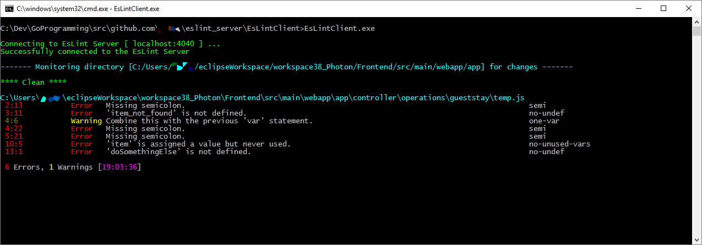

## Eslint Server in NodeJS and Go Reports Client
This application uses a NodeJS GRPC (Google Remote Procedure Call using protocol buffers for data exchange) server to host EsLint CLIEngine Utility. Go client running in Command Prompt / Terminal functions as agents to watch filesystem for any modifications to the JS files and sends the modified file to the NodeJS GRPC server using protobuffs. NodeJS GRPC server scans the content, generates the report and sends back to the Go Client (using protobuff). Go client running in terminal then displays the error/warnings accordingly.

Here's how the Go Client with scan output looks:



1. To install custom HMS Plugins:
    ```
    npm install -S ./eslint
    ```
2. To compile proto buffer for Go (EsLintClient client) use the below command
   ```shell
   C:\Dev\GoProgramming\src\github.com\ksfnu\eslint_server>protoc -I proto/ proto/eslintmessage.proto --go_out=plugins=grpc:EsLintClient/agent proto/eslintmessage.proto
   ```